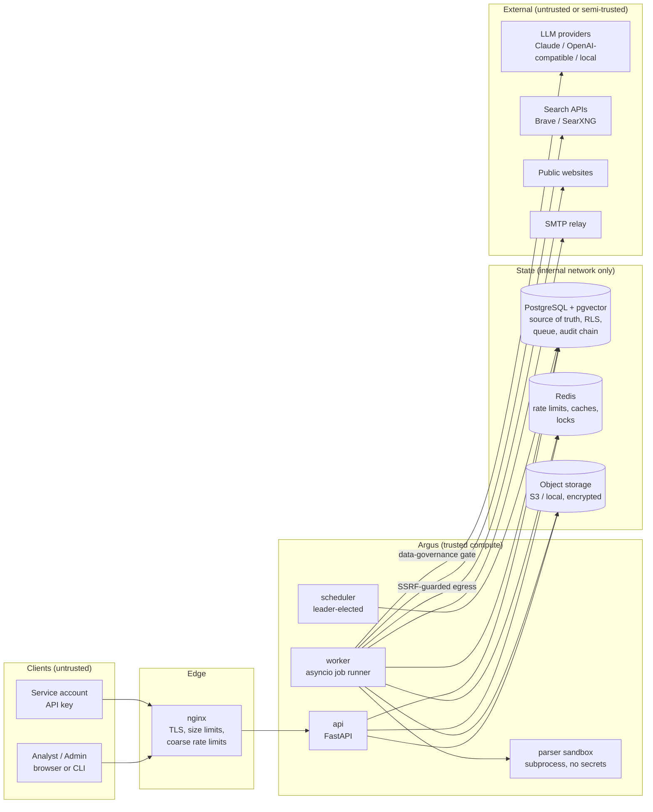
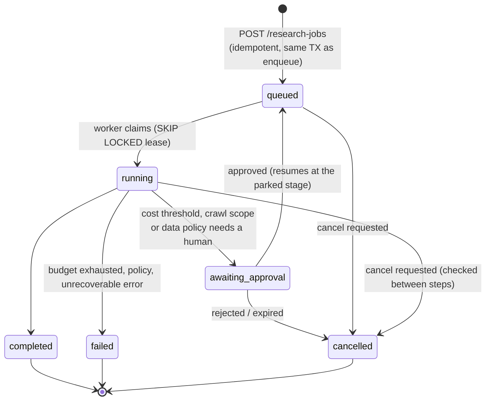
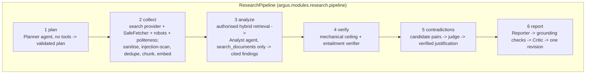

# System Architecture

> Status: authoritative design. Every section names the code that implements it; when the code
> and this document disagree, the code is the bug report. Diagrams are Mermaid and render on GitHub.

Argus is a **multi-tenant AI intelligence and research platform**. A user states a research
objective; the platform plans the research, collects evidence from the web and from the
organisation's own documents, stores it with provenance, retrieves only what the caller is
authorised to see, reasons over it with specialised least-privilege agents, verifies every claim
against its evidence, surfaces contradictions, and produces a cited report. Monitors repeat the
collection on a schedule and alert on meaningful change.

## 1. Architectural style: a modular monolith with three process types

One codebase (`src/argus`), one deployable image, **three process roles**:

| Process | Entry point | Scales | Responsibility |
|---|---|---|---|
| `api` | `argus.apps.api.main:create_app` (Uvicorn) | horizontally, stateless | authentication, authorisation, validation, CRUD, enqueueing work. Never runs long work. |
| `worker` | `argus.apps.worker.main` | horizontally | claims jobs from the durable queue: research pipelines, document processing, embeddings, monitoring checks, notification delivery. |
| `scheduler` | `argus.apps.scheduler.main` | one *active* leader (advisory-lock election), N standbys | enqueues periodic work: due monitors, lease reaping, retention, expiry sweeps. |

Why not microservices: the domain is young, the bounded contexts share one transactional store,
and the team is small. Microservices would buy independent deployment at the price of distributed
transactions, network failure modes between every module, and duplicated auth. The modular monolith
keeps **module boundaries enforced by `import-linter` in CI** (see
[repository-structure.md](repository-structure.md)), so a module can be extracted into a service
later without untangling imports. ADR: [0001](decisions/0001-modular-monolith.md).

## 2. Context and containers



## 3. Request path (API)

```mermaid
sequenceDiagram
    autonumber
    participant C as Client
    participant M as Middleware chain
    participant D as Auth dependency
    participant P as Policy engine
    participant S as Service (use case)
    participant DB as PostgreSQL (RLS)

    C->>M: HTTPS request
    M->>M: request id, client IP (trusted proxies only),<br/>body-size cap, security headers, timeout
    M->>D: route handler dependencies
    D->>D: verify JWT (EdDSA, iss/aud/exp/nbf) or API key (HMAC lookup)
    D->>DB: session not revoked? membership + role?
    D->>P: authorize(principal, permission, org, project)
    P-->>D: allow / deny (deny by default)
    D->>S: TenantScope(org, project, principal)
    S->>DB: BEGIN; set_config('argus.org_id', ...) ;<br/>queries always filtered by organization_id
    DB-->>S: rows (RLS filters again)
    S-->>C: response model (explicit fields only)
```

Middleware order (outermost first) is defined once in `argus.apps.api.main`: tracing → request
context (request id, trusted hosts, client IP) → security headers → timeout → body-size limit →
CORS → routing. Exceptions
become RFC 9457 `application/problem+json` documents carrying the request id and never a stack
trace, file path, SQL text or provider name.

## 4. Research job lifecycle (worker)



While `running`, the job's `stage` field says which step is active. Each stage is a
**checkpointed step** (`research_steps`). A worker that dies mid-job loses its lease; another
worker re-claims the job and resumes at the first unfinished step. Steps are idempotent (they
upsert by natural keys such as `content_hash`), which is what makes at-least-once delivery safe.



The creator of the job is re-authorised at every stage (role, API-key scopes, revocation), so a
job never acts with more rights than its creator has *now*.

## 5. Trust boundaries

| # | Boundary | What crosses it | Primary controls |
|---|---|---|---|
| TB1 | Internet → edge/API | requests from anyone | TLS, size/time limits, authN, rate limits, strict schemas (unknown fields rejected) |
| TB2 | Tenant ↔ tenant | nothing, ever | repository filters + PostgreSQL RLS + composite same-tenant foreign keys + 404-not-403 on foreign ids |
| TB3 | Worker → public web | URLs chosen by search results/LLMs (attacker-influenced) | SSRF guard with DNS pinning, redirect re-validation, size/time/decompression caps, content-type allow-list, robots.txt, per-domain politeness |
| TB4 | Untrusted content → LLM context | web pages, documents, tool output | spotlighting (nonce-delimited data blocks), invisible-character stripping, injection classifier, no privileged instructions built from data |
| TB5 | LLM output → application | plans, tool calls, findings, report text | Pydantic schema validation, tool allow-lists per agent, citation verification, URL allow-listing in rendered output |
| TB6 | Platform → LLM provider | prompts containing tenant data | data classification × organisation policy (allowed / restricted / never-external), secret redaction, local-provider route |
| TB7 | Upload → parser | arbitrary bytes | magic-byte sniffing, size/decompression limits, XXE-safe XML, subprocess sandbox with scrubbed environment and timeouts, malware-scan port, quarantine |
| TB8 | Application → database | queries | parameterised SQL only, least-privilege roles (owner ≠ runtime), RLS, statement timeouts |

The full STRIDE analysis is in [../security/threat-model.md](../security/threat-model.md).

## 6. State ownership

| Store | Holds | Source of truth? | Loss impact |
|---|---|---|---|
| PostgreSQL | everything relational, vectors, full-text indexes, the job queue, idempotency records, audit chain | **yes** | restore from PITR backup (RPO ≤ 5 min) |
| Object storage | uploaded originals, raw fetched pages, report exports | yes for blobs; metadata lives in PostgreSQL | restore from versioned bucket |
| Redis | rate-limit counters, robots.txt cache, retrieval cache, session-revocation cache, politeness locks | **no** - every key has a TTL and can be rebuilt | temporary loss of rate-limit precision (fail-open or fail-closed per policy, see security model) |

Choosing PostgreSQL for the queue (rather than Redis/Celery) means *creating a research job and
enqueueing it happen in one transaction* - there is no window where the job exists but the work
was never queued, or the work runs before the row is visible. ADR:
[0003](decisions/0003-postgres-job-queue.md).

## 7. Module map

| Module (`argus.modules.*`) | Bounded context | Key tables |
|---|---|---|
| `identity` | users, credentials, sessions, MFA, API keys, service accounts | users, user_sessions, refresh_tokens, one_time_tokens, mfa_totp, recovery_codes, api_keys, service_accounts |
| `tenancy` | organisations, memberships, invitations, projects, project roles | organizations, organization_members, invitations, projects, project_members |
| `audit` | tamper-evident security log | audit_logs |
| `research` | jobs, plans, steps, pipeline orchestration, approvals; the planning, collection, analysis, verification, contradiction and report stages; exports | research_jobs, research_plans, research_steps, approval_requests, research_findings, research_citations, research_contradictions, research_reports |
| `sources` | source registry, reputation, search providers, collection | sources, source_snapshots, domain_policies |
| `documents` | uploads, validation, sandboxed parsing, chunking | documents, document_chunks |
| `knowledge` | chunking, embeddings, hybrid retrieval, reranking, answers | document_chunks |
| `llm` | gateway, providers, routing, budgets, prompt registry, governance, usage | llm_requests, llm_usage_daily, prompt_deployments |
| `agents` | agent specs, runtime, tools, kill switches | agent_runs, tool_calls, kill_switches |
| `monitoring` | monitors, targets, change detection and significance | monitors, monitor_targets, monitor_changes |
| `notifications` | in-app and e-mail notifications for platform events | notifications |
| `security_center` | audit integrity checks, kill-switch administration, security posture and events, denied-access auditing | audit_verifications |
| `evaluation` | offline AI evaluation and red-team suites | (files under `evals/`) |
| `platform` | plans and quotas, usage report, retention, organisation lifecycle, data exports, dashboard overview | organization_exports, audit_checkpoints (with `audit`) |

Cross-cutting packages: `argus.core` (configuration, errors, ids, clock, logging, redaction,
crypto), `argus.infrastructure` (database, Redis, object storage, queue, e-mail, observability)
and `argus.security` (passwords, tokens, rate limiting, SSRF guard, safe fetcher, content sniffing,
injection detection, sandbox).

## 8. Scalability model

* **API** is stateless: scale on CPU/latency behind a load balancer. Session revocation and rate
  limits live in shared stores, never in process memory (the in-memory limiter exists for
  development and refuses to start in production).
* **Workers** scale on queue depth (`argus_queue_depth` gauge). Claiming uses
  `FOR UPDATE SKIP LOCKED`, so N workers never block each other; `LISTEN/NOTIFY` wakes idle workers
  instantly with polling as the fallback.
* **Per-domain politeness** is enforced through Redis, so adding workers cannot turn the crawler
  into a denial-of-service against a website.
* **PostgreSQL** is the first bottleneck. Mitigations in order: indexes and keyset pagination
  (already designed in), read replicas for retrieval, PgBouncer in transaction mode (our tenant
  context uses `set_config(..., is_local => true)` precisely so it is pooler-safe), then
  partitioning `document_chunks` by organisation, then an external vector index for the largest
  tenants.
* **LLM throughput** is bounded by provider rate limits; the gateway applies per-provider token
  buckets and per-organisation budgets so one tenant cannot starve the others.

## 9. Failure handling summary

| Failure | Behaviour |
|---|---|
| LLM timeout / 429 / 5xx | bounded retries with full-jitter backoff honouring `retry-after`, then the next model in the route; circuit breaker opens per provider-model |
| Malformed LLM output | schema validation fails → one repair attempt with the validation error → step fails with `llm_output_invalid` |
| Website down / slow | per-fetch deadline; the source is recorded as failed and the plan continues with the remaining sources |
| Worker crash | lease expires → job re-queued → resumes from last checkpoint; after `max_attempts` → dead-letter (`status = dead`) with sanitised error |
| Redis down | rate limits fall back to per-process counters (alert `ArgusRateLimitDegraded`); caches are bypassed; nothing is lost |
| PostgreSQL down | readiness probe fails, load balancer drains the instance; workers back off |
| Duplicate submission | `Idempotency-Key` replays the stored response; a different body with the same key is rejected |

See [../operations/incident-response.md](../operations/incident-response.md) and
[../operations/disaster-recovery.md](../operations/disaster-recovery.md).

## 10. Observability

```text
api ── TracingMiddleware: server span "POST /api/v1/orgs/{org_id}/..." (route template only)
  └─ enqueue: jobs.trace_parent = W3C traceparent of the current span
worker ── span "job research.run" (continues that trace)
  └─ "research.stage <key>" ── "agent.run <agent>" ── "chat <model>" (tokens, cost, outcome)
                                                    └─ "agent.tool <tool>" (outcome)
     └─ "knowledge.retrieve" · "egress.fetch" (host only) · "db SELECT|INSERT|..." (parameterised)
scheduler ── span "scheduler <task>"
```

* **Traces**: OpenTelemetry, exported over OTLP/HTTP to a collector that scrubs attribute keys
  that must never be stored, then to the trace store. Off unless configured; head sampling with
  parent-based ratio. Incoming `traceparent` is ignored unless explicitly trusted. Outgoing
  requests to third-party sites never carry trace headers.
* **Metrics**: Prometheus, one registry per process - the API serves `/metrics`, workers and the
  scheduler serve it on `ARGUS_OBSERVABILITY__METRICS_PORT`; all behind a bearer token in
  production. Labels are bounded sets (route templates, task names, outcomes) - never ids.
* **Logs**: structured JSON, redacted, with `request_id`, organisation, job, agent run, tool
  call and the active `trace_id`/`span_id`.
* **Alerts and dashboards**: `deploy/observability/` (rules with runbooks in
  [../operations/alerts.md](../operations/alerts.md), a generated Grafana dashboard, the
  collector configuration and a local stack); a unit test fails if any of them references a
  metric the code does not export.
