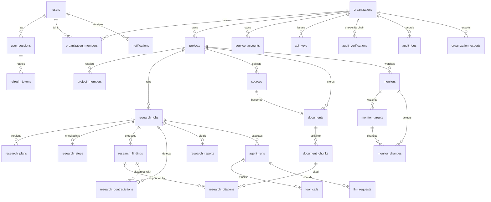

# Database Design

PostgreSQL 16+ with the `vector` (pgvector) and `pgcrypto` extensions. The schema is created only by
Alembic migrations in `migrations/versions/`, run by the **owner** role. The application runs as a
separate **runtime** role that can read and write rows but cannot change the schema, cannot bypass
Row-Level Security, and cannot update or delete audit records.

## 1. Roles and privileges

| Role | Login | Owns schema | `BYPASSRLS` | Used by | Privileges |
|---|---|---|---|---|---|
| `argus_owner` | yes | **yes** | no (owner is exempt from non-forced RLS) | `argus db migrate` and operator commands (`argus audit`, `argus orgs`, `argus killswitch`) | DDL; owns `SECURITY DEFINER` helper functions; the only role that can delete audit rows, and only through `argus_prune_audit` |
| `argus_app` | yes | no | **no** | api, worker, scheduler | `SELECT/INSERT/UPDATE/DELETE` on application tables; `SELECT/INSERT` only on `audit_logs`; `EXECUTE` on the helper functions |

Role creation is an infrastructure concern (superuser): `docker/postgres/init/01-roles.sh` in
development, the platform team's IaC in production. Migrations only `GRANT`. The role names are
configurable (`ARGUS_DATABASE__APP_ROLE`), so two deployments can share a cluster.

Every runtime connection sets `statement_timeout`, `lock_timeout` and
`idle_in_transaction_session_timeout` so one bad query cannot hold locks indefinitely.

## 2. Conventions

* Primary keys are **UUIDv7** generated by the application (`argus.core.ids.uuid7`): globally
  unique, unguessable enough for public ids, and time-ordered so B-tree inserts stay local.
  The audit log uses a `bigint` identity because its order defines the hash chain.
* Every timestamp is `timestamptz`, written in UTC. Audit fields: `created_at`, `updated_at`, and
  `created_by` where an actor exists.
* Constraint names are deterministic (`pk_`, `fk_`, `uq_`, `ix_`, `ck_`) via SQLAlchemy's naming
  convention, so migrations are reviewable and reversible.
* Enumerations are `text` columns with `CHECK` constraints (cheap to extend; no `ALTER TYPE`
  migrations). Data classification is a `smallint` (0 public, 1 internal, 2 confidential,
  3 restricted) so ceilings are a simple `<=` comparison.
* Lists are keyset-paginated on `(created_at, id)`; there is no `OFFSET` anywhere.

## 3. Tenant isolation in the schema

```sql
-- every tenant table
ALTER TABLE projects ENABLE ROW LEVEL SECURITY;
CREATE POLICY tenant_isolation ON projects
    USING (organization_id = argus_current_org())
    WITH CHECK (organization_id = argus_current_org());

-- helper, STABLE so the planner evaluates it once per statement
CREATE FUNCTION argus_current_org() RETURNS uuid LANGUAGE sql STABLE AS $$
    SELECT NULLIF(current_setting('argus.org_id', true), '')::uuid
$$;
```

An unset `argus.org_id` yields `NULL`, and `organization_id = NULL` is never true: **no context,
no rows**. The unit of work writes the setting with `set_config('argus.org_id', :id, true)`
(transaction-local), which is safe under connection pooling and PgBouncer transaction mode.

**Composite same-tenant foreign keys.** Parents expose `UNIQUE (organization_id, id)`; children
reference both columns:

```sql
ALTER TABLE documents
    ADD CONSTRAINT fk_documents_project
    FOREIGN KEY (organization_id, project_id) REFERENCES projects (organization_id, id)
    ON DELETE CASCADE;
```

A document can therefore never belong to another tenant's project, whatever the application does.

Tables **without** RLS are either global identity data scoped by user id in the repository layer
(`users`, `user_sessions`, `refresh_tokens`, `one_time_tokens`, `mfa_*`), infrastructure that
carries identifiers only (`jobs`, `idempotency_keys`, `audit_chain_heads`), or platform
configuration (`prompt_deployments`).

## 4. Entity-relationship overview



## 5. Table catalogue

| Table | RLS | Purpose | Notable constraints / indexes |
|---|---|---|---|
| `users` | - | identity; Argon2id hash; lockout counters | `uq(email)` (normalised lower-case) |
| `user_sessions` | - | one row per login/device | `ix(user_id, revoked_at)` |
| `refresh_tokens` | - | rotating refresh tokens (hash only) | `uq(token_hash)`, `fk(session_id) on delete cascade` |
| `one_time_tokens` | - | e-mail verification, password reset, MFA challenge (hash only, single use, attempt counter) | `uq(token_hash)`, `ck(purpose)` |
| `mfa_totp` | - | AES-GCM-encrypted TOTP secret + last used step (replay protection) | `pk(user_id)` |
| `mfa_recovery_codes` | - | Argon2id-hashed single-use recovery codes | `ix(user_id)` |
| `organizations` | yes* | tenant root; status (`active`, `suspended`, `pending_deletion`, `purging`); plan; data-governance policy; settings (budgets, retention) | `uq(slug)`; `ck(plan)` over the code catalogue |
| `organization_members` | yes* | user ↔ organisation role | `pk(organization_id, user_id)` |
| `invitations` | yes | e-mail invitations (hash only) | `uq(token_hash)` |
| `projects` | yes | research workspaces; `visibility` organisation/restricted | `uq(organization_id, name)`, `uq(organization_id, id)` |
| `project_members` | yes | per-project role for restricted projects | composite FKs to `projects` and `organization_members` (removing an org member cascades) |
| `service_accounts` | yes | non-human principals | `uq(organization_id, name)` |
| `api_keys` | yes | key id + HMAC hash, scopes, expiry | `uq(key_id)`; exactly one owner (user xor service account) |
| `audit_logs` | yes | append-only, HMAC-chained security log | trigger rejects `UPDATE` and every `DELETE` except the schema owner's inside `argus_prune_audit`; a second trigger (`argus_audit_insert_guard`) rejects rows at or below the chain's checkpoint; runtime role has no `UPDATE`/`DELETE` grant |
| `audit_chain_heads` | - | last hash per chain (organisation or platform) | row lock serialises appends per chain |
| `audit_checkpoints` | yes*** | where a pruned chain now starts: sequence, hash and an HMAC over them (the key is outside the database) | `pk(chain_key, seq)`; append-only trigger; the runtime role reads only its own organisation's rows |
| `jobs` | - | durable queue (leases, retries, dead letters) | partial index on queued jobs; partial unique `dedup_key` for active jobs |
| `idempotency_keys` | - | stored responses for `Idempotency-Key` | `pk(principal, key)`; expiry sweep |
| `research_jobs` | yes | job state, budgets, spend, progress | composite FK to project |
| `research_plans` | yes | validated plan versions | `uq(job_id, version)` |
| `research_steps` | yes | checkpoints | `uq(job_id, key)` |
| `approval_requests` | yes | human-in-the-loop gates | `ix(organization_id, status)` |
| `sources` | yes | provenance of every collected URL / upload | `uq(organization_id, project_id, url_hash)` |
| `domain_policies` | yes | per-organisation allow/block/approval per domain | `uq(organization_id, domain)` |
| `documents` | yes | uploaded or collected documents, lifecycle status | `uq(organization_id, project_id, sha256)` |
| `document_chunks` | yes | text, `tsvector` (generated), `vector(N)` embedding | HNSW cosine, GIN, composite FK cascade from documents |
| `research_findings`, `research_citations`, `research_contradictions` | yes | claims with their verification verdict, evidence and disagreements | citations reference chunks and contradictions reference findings (cascade on delete) |
| `research_reports` | yes | canonical JSON report + rendered Markdown + quality scores + the highest classification it rests on | `uq(job_id, version)` |
| `agent_runs`, `tool_calls` | yes | agent execution trail (arguments redacted) | `ix(job_id)` |
| `llm_requests`, `llm_usage_daily` | yes | per-call accounting and daily roll-up for budgets | `pk(organization_id, day, provider, model)` |
| `prompt_deployments` | - | active prompt version per environment (rollback) | `pk(name, environment)` |
| `kill_switches` | yes** | platform-wide and organisation stop switches for all AI, an agent, a tool, a provider or a model | partial index on active switches |
| `monitors`, `monitor_targets`, `monitor_changes` | yes | continuous monitoring; targets keep their own last-snapshot pointer | `ix(next_run_at) where status = 'active'`; `uq(monitor_id, url)` |
| `notifications` | yes | in-app notifications (plain text, application links only) | `ix(organization_id, user_id) where read_at IS NULL` |
| `audit_verifications` | yes | history of audit-chain integrity checks (scheduled and manual) | `ck(outcome)`: valid ⇔ no reason; `ix(organization_id, verified_at)`; 90-day retention |
| `organization_exports` | yes | owner-requested data exports: status, sealed archive key, size, SHA-256, expiry | `ck(status)` (`pending`, `ready`, `failed`, `expired`); partial unique index: one `pending` per organisation |

\* `organizations` and `organization_members` also allow a user to see the organisations they belong
to (`user_id = argus_current_user()`), which is what "list my organisations" needs before any
organisation is selected.

\*\* `kill_switches`: the runtime role reads its own organisation's rows *and* the platform-wide
ones (`organization_id IS NULL`), but writes only its own organisation's; platform-wide switches
are written with the owner role (`argus killswitch`).

\*\*\* `audit_checkpoints` is keyed by chain, not organisation: its policy compares `chain_key`
with the current organisation, so the platform chain's checkpoints are visible to the owner role
only. The runtime role never writes it; `argus_prune_audit` (owner) does.

The knowledge-graph tables of the original plan (`entities`, `entity_mentions`,
`entity_relationships`) do not exist: phase 18 was skipped by decision (see the roadmap).

### Narrow SECURITY DEFINER functions

The runtime role cannot read across tenants. The few platform duties that must, use functions
owned by `argus_owner` that return identifiers or counts only, with `search_path` pinned and
`EXECUTE` revoked from `PUBLIC`:

| Function | Used by | Returns |
|---|---|---|
| `argus_authenticate_api_key(key_id, secret_hash)` | API-key authentication | the key's row and its organisation status |
| `argus_find_invitation(token_hash)` | accepting an invitation | the invitation |
| `argus_claim_due_monitors(max_rows)` | scheduler | `(organization_id, monitor_id)` pairs, advancing their next run |
| `argus_purge_read_notifications(cutoff)` | scheduler | number of deleted notifications |
| `argus_audit_verification_due(max_rows, verified_before)` | scheduler | organisation ids whose audit chain is due a check |
| `argus_organizations_for_retention(after, max_rows)` | scheduler (retention) | ids of active and suspended organisations with their retention settings, nothing else |
| `argus_organizations_due_for_purge(before, max_rows)` | scheduler (purge) | ids of organisations whose grace period has passed, interrupted purges first |
| `argus_prune_audit(chain, seq, hash, mac)` | retention, `argus audit prune` | the number of pruned rows; refuses rows younger than 90 days, another organisation's chain, the platform chain from the runtime role and an anchor that does not match |

## 6. Deletion and lifecycle guarantees

* **Document deletion** deletes the row in one transaction; chunks, embeddings, full-text vectors
  and citations go with it through `ON DELETE CASCADE`. The blob is removed by a
  queued `storage.delete` job (retried until it succeeds) and retrieval caches are invalidated by
  bumping the project's corpus version, which is part of every cache key.
* **Organisation deletion** is a two-step process: `pending_deletion` (members lose access
  immediately, API keys are revoked, data is kept for `platform.deletion_grace_days` so an
  operator can restore it) → the hourly purge marks it `purging` (no restore from here on),
  deletes the organisation's stored blobs and then its row; every tenant table follows through
  same-tenant `ON DELETE CASCADE` keys. An interrupted purge is finished by the next run. Cache entries
  expire with their TTL. The audit chain is kept on purpose, and the purge is recorded in the
  platform chain.
* **Retention** (`platform.retention`, daily, each organisation in its own RLS context, 1,000
  rows per transaction): superseded page versions older than `retention.raw_snapshots_days`
  (never the version of a source seen most recently, never a monitor's baseline), monitor changes older
  than `retention.monitor_snapshots_days`, per-call model ledger rows older than
  `platform.llm_requests_retention_days` (daily aggregates stay), expired exports and their
  archives, finished queue jobs, and audit events older than `retention.audit_days` (at least
  90) behind a signed checkpoint. Uploaded documents are kept until someone deletes them.

## 7. Migration workflow

```bash
argus db migrate            # alembic upgrade head, as the owner role
argus db revision -m "..."  # autogenerate, then review by hand - RLS policies are always explicit
argus db check              # fails if models and migrations have drifted (CI)
```

Migrations are forward-only in production (a fix is a new migration); `downgrade()` is provided for
development and tested in CI by upgrading, downgrading to base and upgrading again.
