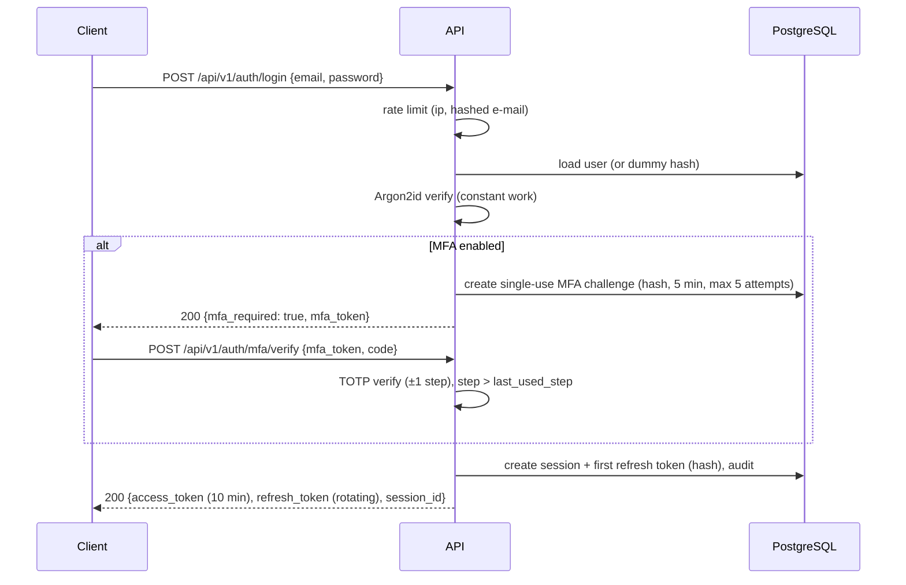

# Security Model

This document describes the controls. [threat-model.md](threat-model.md) explains which threats
they answer. Principles applied everywhere: zero trust between components, least privilege, defence
in depth, secure by default, fail closed, explicit authorisation, minimal secrets, validate
everything, log security events, separate trust boundaries, minimal agent permissions.

## 1. Identity and authentication

### 1.1 Passwords
* Argon2id (`argon2-cffi`), parameters `time_cost=3, memory_cost=64 MiB, parallelism=4` (RFC 9106
  low-memory profile), re-hashed transparently at login when parameters change.
* Policy (NIST SP 800-63B): 12-128 characters, no composition rules, rejected if it appears in the
  bundled common-password list or contains the e-mail local part. The 128-character maximum bounds
  hashing cost (DoS).
* Unknown e-mail addresses still run a dummy Argon2 verification so response time does not reveal
  whether an account exists.
* Lockout is **temporary and progressive** (5 failures → 1 min, doubling to 15 min) - a permanent
  lockout would hand attackers a denial-of-service button. IP and e-mail rate limits run first.

### 1.2 Login flow

### 1.3 Tokens and sessions
See [ADR 0005](../architecture/decisions/0005-token-architecture.md). Summary: EdDSA JWT access
tokens (10 min) checked against a live session on every request; opaque refresh tokens rotated on
every use with reuse detection; sessions have an absolute lifetime (30 days) and an idle lifetime
(the refresh token's 7 days). Users can list and revoke their sessions individually.

### 1.4 MFA
TOTP (RFC 6238, SHA-1, 6 digits, 30 s - the authenticator-app standard). Secrets are encrypted with
AES-256-GCM using the user id as associated data, so a ciphertext copied to another user's row
does not decrypt. Enrolment requires confirming one code. Ten single-use recovery codes are shown
once and stored as Argon2id hashes. Disabling MFA requires the password and a current code.

### 1.5 API keys and service accounts
Service accounts are non-human principals owned by an organisation with a role. API keys belong to
exactly one principal (a user or a service account), carry scopes, may expire, and are shown in full
exactly once. A key's effective permissions are `scopes ∩ owner's current role`, recomputed on every
request, so demoting a user immediately demotes their keys. Some permissions can never be given to
a key, whatever its owner's role: `org:delete`, `org:export`, `members:manage`, `apikeys:manage`,
`service_accounts:manage` and `security:manage` - a leaked key cannot delete or export the
organisation, change who belongs to it, mint more keys or switch off security controls.

## 2. Authorisation

Deny by default. The policy engine (`argus.security.authorization`) answers
`authorize(principal, permission, organization_id, project=None)`.

### 2.1 Organisation roles

| Permission | owner | admin | analyst | viewer |
|---|:-:|:-:|:-:|:-:|
| `org:read` | ✓ | ✓ | ✓ | ✓ |
| `org:update` (name, data policy, budgets) | ✓ | ✓ | | |
| `org:delete`, `org:export` (whole-organisation data export) | ✓ | | | |
| `members:read` | ✓ | ✓ | ✓ | ✓ |
| `members:invite`, `members:manage` | ✓ | ✓ | | |
| `projects:read` | ✓ | ✓ | ✓ | ✓ |
| `projects:create`, `projects:update` | ✓ | ✓ | ✓ | |
| `projects:delete`, `projects:manage_members` | ✓ | ✓ | | |
| `research:read` | ✓ | ✓ | ✓ | ✓ |
| `research:create`, `research:cancel` | ✓ | ✓ | ✓ | |
| `documents:read` | ✓ | ✓ | ✓ | ✓ |
| `documents:upload`, `documents:delete` | ✓ | ✓ | ✓ | |
| `documents:read_restricted` | ✓ | ✓ | | |
| `sources:read`, `knowledge:read`, `reports:read`, `monitors:read` | ✓ | ✓ | ✓ | ✓ |
| `sources:manage`, `reports:export`, `monitors:manage` | ✓ | ✓ | ✓ | |
| `apikeys:read`, `apikeys:manage`, `service_accounts:manage` | ✓ | ✓ | | |
| `webhooks:manage` (reserved for future outbound integrations), `approvals:decide`, `audit:read`, `usage:read`, `security:manage` | ✓ | ✓ | | |

Role-change rules: nobody changes their own role; only an owner grants or removes `owner`; the last
owner cannot leave or be demoted.

### 2.2 Projects
`visibility = organization`: every member uses their organisation role. `visibility = restricted`:
owners and admins keep access; everyone else needs a `project_members` row with role `editor`
(analyst-level inside the project) or `viewer`. Without access the project answers **404**, not 403,
so its existence is not disclosed.

### 2.3 Where checks happen
1. **Route dependency** - authenticates, resolves membership, calls the policy engine.
2. **Service layer** - receives a `TenantScope` and only operates inside it.
3. **Repository layer** - filters by `organization_id` (and project scope).
4. **Database** - RLS policies (fail closed) and composite foreign keys.

## 3. Tenant isolation
[ADR 0002](../architecture/decisions/0002-tenant-isolation.md). Redis keys are prefixed
`argus:{env}:org:{org_id}:...`; object-storage keys are `org/{org_id}/project/{project_id}/...`;
caches include the organisation id and the project's corpus version.

## 4. Rate limiting
GCRA (generic cell rate algorithm) in one Lua script, so a check-and-update is atomic across API
replicas. Policies are data (`argus.security.ratelimit.POLICIES`), applied at several levels:

| Policy | Key | Limit |
|---|---|---|
| `global.ip` | client IP (trusted-proxy aware) | 300 / min |
| `auth.login.ip` / `auth.login.account` | IP / SHA-256(e-mail) | 20 / min / 10 per 15 min |
| `auth.register.ip` | IP | 10 / hour |
| `auth.password_reset` | IP and e-mail hash | 5 / hour |
| `auth.mfa` | challenge / user | 10 / 15 min |
| `api.principal` | user or API key | 600 / min |
| `research.create` | organisation / user | 60 / hour / 20 / hour |
| `documents.upload` | organisation | 200 / hour |
| `fetch.domain` | target domain (politeness) | 1 request / 2 s (robots `Crawl-delay` honoured when larger) |
| `llm.provider` | provider-model | provider quota |

If Redis is unavailable the limiter **degrades to an in-process GCRA limiter** (limits become
per-instance rather than disappearing) and logs `ratelimit.degraded`. Responses carry `RateLimit`,
`RateLimit-Policy` and `Retry-After`. The client IP is taken from `X-Forwarded-For` only when the
direct peer is inside `ARGUS_HTTP__TRUSTED_PROXIES`.

## 5. Secrets and cryptography

| Secret | Where it lives | Rotation |
|---|---|---|
| JWT signing keys (Ed25519) | env var or `*_FILE` (Docker/K8s secret) - API only | add new `kid` → sign with it → retire old after max token lifetime |
| Data-encryption keys (AES-256-GCM keyring) | env / secret file | new key id for new writes; old ids stay readable; re-encryption job |
| API-key pepper, audit HMAC key | env / secret file | dual-key verification window |
| Provider API keys | env / secret file - worker only | provider console |
| Database / Redis passwords | secret files | infrastructure |

`Settings` stores secrets as `SecretStr` (never printed), loads `NAME_FILE` variants, and **refuses
to start in production** with development defaults, debug on, wildcard CORS, missing keys, or
in-memory rate limiting. Secrets never appear in Git (gitleaks), logs (redaction), URLs, prompts
(redaction before the gateway), error responses, or database dumps (only hashes or ciphertexts are
stored).

## 6. Web egress and content safety
[ADR 0008](../architecture/decisions/0008-ssrf-safe-egress.md) for SSRF. Additionally:
robots.txt (Protego) is respected by default, every fetch identifies the platform in `User-Agent`,
crawling is bounded per job (pages, depth, bytes), HTML is parsed with selectolax and never
executed, hidden elements (`display:none`, `aria-hidden`, zero-size text) are dropped during
extraction because hidden text is a common injection carrier, and extracted text is normalised
(Unicode NFC), stripped of bidi-override and tag characters (Trojan-Source style) while keeping
characters that real languages need (e.g. ZWNJ U+200C in Persian).

## 7. Documents
[ADR 0009](../architecture/decisions/0009-document-storage-and-parsing.md). In short:

* **Type by content** - magic-byte sniffing (`argus.security.content`) decides the type; the
  extension and the declared MIME type must agree; executables and archives are refused whatever
  they are called. Display names are sanitised (path segments, controls, bidi overrides removed);
  storage keys are server-generated.
* **Limits** - 25 MB upload (enforced while the body streams in), one file per request, 2,000 PDF
  pages, DOCX ≤ 1,000 ZIP entries and ≤ 100 MB declared uncompressed with a 100:1 ratio cap
  (checked from the central directory before any member is read), JSON depth ≤ 64 (measured
  without recursion), CSV fields ≤ 1 MB, ≤ 1,000 columns, extracted text ≤ 5 M characters.
* **Encryption at rest** - envelope encryption per object (AES-256-GCM data key wrapped by the
  keyring), bound to the storage key; the bucket or disk never holds plaintext.
* **Scan before use** - documents stay `pending_scan` (not parsed, not downloadable) until ClamAV
  reports them clean; outages retry, they never skip. Infected files are `quarantined` and audited
  as security events. Development uses a stand-in that only recognises the EICAR test file, and
  production configuration refuses it.
* **Sandboxed parsing** - a fresh process per document with an empty environment, `-I` isolated
  interpreter, private temporary directory, wall-clock timeout (process-group kill) and, on POSIX,
  `RLIMIT_AS`, `RLIMIT_CPU`, `RLIMIT_FSIZE=0`, `RLIMIT_NOFILE`, `RLIMIT_CORE=0` and
  `RLIMIT_NPROC=0`. XML is parsed with defusedxml (no DTDs or entities). The parent treats the
  sandbox's output as untrusted (schema-validated, re-sanitised, bounded). This is process
  isolation, not kernel isolation: production deployments that parse untrusted tenants' files at
  scale should run workers under gVisor or a seccomp profile and without network egress.
* **Hidden content** - hidden Word runs (`w:vanish`, ≤ 1 pt text), HTML comments in Markdown and
  hidden HTML elements are removed from the text and kept as evidence for the injection
  assessment; PDFs report active-content features (JavaScript, Launch, embedded files, XFA).
* **Downloads** - through the API only: authenticated `GET .../content` for API clients, or
  5-minute HMAC-signed links for browsers that are re-authorised when clicked (session, membership,
  permission, document state). Always `attachment`, `nosniff`, `no-store`, CSP `sandbox`; HTML is
  served as `application/octet-stream`; link tokens are redacted from access logs.
* **Classification** - `restricted` documents are invisible (404) without
  `documents:read_restricted`, and only users who could read them may upload them.

## 8. Prompt-injection defence (five layers)
1. **Input classification** - `argus.security.injection` scores text for override phrases,
   role/turn spoofing, exfiltration patterns, tool-coercion and hidden Unicode; high-risk chunks are
   excluded from LLM context and listed in the report's "excluded sources" appendix.
2. **Trust boundaries** - messages are built from typed parts (`TrustedInstruction`,
   `UserRequest`, `UntrustedData`); untrusted data is only ever placed inside nonce-delimited data
   blocks in the user turn, never rendered into the system prompt.
3. **Tool permissions** - allow-lists per agent; the taint rule; nothing in content can add tools.
4. **Output validation** - Pydantic schemas, citation verification, URL allow-listing.
5. **Human approval** - cost thresholds, data-governance escalation, crawl scope, destructive
   operations (`approval_requests`).

## 9. Logging, audit and detection
* structlog JSON logs with `request_id`, `trace_id`, `user_id`, `organization_id`, `job_id`,
  `agent_run_id`, `tool_call_id`; the redaction processor removes credential-shaped values and
  sensitive keys before rendering.
* The audit log records authentication, authorisation failures, key and role changes, research
  creation, document access and deletion, agent tool executions, approvals, kill switches and
  administrative actions. It is append-only and HMAC-chained; `argus audit verify` checks it.

## 10. Incident controls
`argus` CLI and admin API: disable an account (`argus users disable`: sign-in, every session and
its API keys), revoke an API key, suspend an organisation (`argus orgs suspend`), engage kill
switches (all AI, an agent, a tool, a provider or a model; per organisation in the API,
platform-wide with `argus killswitch`), stop the workers (scale them to zero: queued jobs wait,
nothing is lost), block a domain. See
[../operations/incident-response.md](../operations/incident-response.md).
